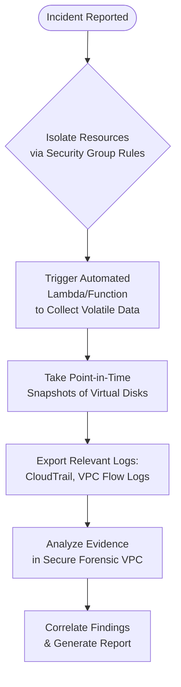

# Cloud Forensics: Challenges and Opportunities in Digital Investigations

**Author:** Mahesh Annayboeina
**Date:** October 2025
**Course:** Cyber Crime Investigation & Digital Forensics (CCIDF)
**Self-Learning Based On:** Digital Forensics Concepts (Infosys Springboard) & Zscaler Internship Experience

## 1. Introduction

The paradigm of data storage and processing has irrevocably shifted from on-premise servers to distributed cloud environments. Platforms like Amazon Web Services (AWS), Microsoft Azure, and Google Cloud Platform (GCP) now host the critical infrastructure for a majority of modern enterprises. While this transition offers scalability and efficiency, it introduces profound complexity for cyber crime investigations. Cloud forensics, a specialized subset of digital forensics, addresses the unique challenges of identifying, acquiring, preserving, and analyzing digital evidence located in these volatile, multi-tenant, and borderless environments. Unlike traditional forensics where investigators could physically seize a hard drive, cloud investigations require a new set of tools, methodologies, and a deep understanding of cloud architecture to successfully navigate the virtual crime scene.

## 2. The Fundamental Shift from Traditional to Cloud Forensics

The core principles of forensics remain, but their application is radically different in the cloud. The traditional model of seizing a physical device is obsolete. Investigators cannot simply walk into a data center and unplug a server that hosts data for hundreds of other clients. This shift necessitates a move from a device-centric to a data-centric approach, where the focus is on acquiring relevant data through logical means, often with the cooperation of the Cloud Service Provider (CSP).

## 3. Key Challenges in Cloud Investigations

Navigating a cloud environment during a forensic investigation presents several significant hurdles:

#### **a) Jurisdictional Complexity**
Data in the cloud is often distributed across multiple data centers in different countries. A single piece of evidence may be fragmented and stored in regions with conflicting data privacy laws (e.g., GDPR in Europe). Determining which legal jurisdiction applies is a major challenge that can stall or invalidate an investigation.

#### **b) Multi-Tenancy and Data Segregation**
In a public cloud, your data resides on the same physical hardware as other customers' data. This creates a significant problem of isolation. Forensic tools must be precise enough to acquire only the target's data without violating the privacy of other tenants, a task that is technically and legally complex.

#### **c) Lack of Physical Access**
Investigators have no physical access to the underlying hardware. This eliminates traditional forensic techniques like disk imaging at the hardware level. All evidence acquisition must be performed logically through APIs and provider-supplied tools, which may not capture all forensic artifacts.

#### **d) Volatility of Evidence**
Cloud environments are dynamic by nature. Logs, snapshots, and even entire virtual machines can be configured to be ephemeral, meaning they exist for a short period and are then automatically deleted. Critical evidence like system memory or temporary files can be lost forever if not captured immediately after an incident.

#### **e) Reliance on Cloud Service Providers (CSPs)**
Investigators are heavily dependent on the cooperation and capabilities of the CSP. The quality and granularity of logs, the availability of forensic tools, and the speed of response from the provider's support team can significantly impact the outcome of an investigation.

## 4. Opportunities and Modern Forensic Techniques

Despite the challenges, the cloud also offers powerful new opportunities for investigators who adapt their methods.

#### **a) Centralized Logging and Monitoring**
CSPs offer robust logging services (e.g., AWS CloudTrail, Azure Monitor) that record every API call and administrative action. When properly configured, these logs provide an immutable audit trail of all activity within an account, offering a level of visibility that is often superior to on-premise environments.

#### **b) API-Driven Automation**
The entire cloud infrastructure is managed via APIs. This allows forensic investigators to automate evidence collection at a massive scale. Scripts can be written to simultaneously take snapshots of virtual disks, export logs from multiple services, and isolate compromised resources in a matter of minutes, drastically reducing response time.

#### **c) "Forensics as a Service" (FaaS)**
Many CSPs and third-party vendors now offer specialized forensic services. These tools can be deployed on-demand to analyze cloud environments, identify indicators of compromise, and generate detailed reports, democratizing access to advanced forensic capabilities.

#### **d) Live Forensics and Snapshots**
Instead of taking a machine offline, cloud forensics heavily relies on "live forensics." Investigators can create a point-in-time snapshot of a virtual machine's disk without service interruption. This snapshot can then be mounted and analyzed in a separate, sanitized forensic environment, preserving the integrity of the original evidence.

*A simplified workflow for an automated forensic response in the cloud.*

## 5. Conclusion

The rise of cloud computing has fundamentally reshaped the landscape of digital forensics. While it introduces significant challenges related to jurisdiction, multi-tenancy, and data volatility, it also provides an unprecedented opportunity to leverage automation and centralized logging for more efficient and thorough investigations. The future of cyber crime investigation is not about trying to apply old methods to new problems; it is about embracing a new mindset. Success in this domain will belong to the investigators who are as fluent in using a CSP's API and automation scripts as their predecessors were with disk imaging tools. Collaboration with cloud providers and a commitment to continuous learning are no longer optional—they are essential for bringing criminals to justice in the digital age.
