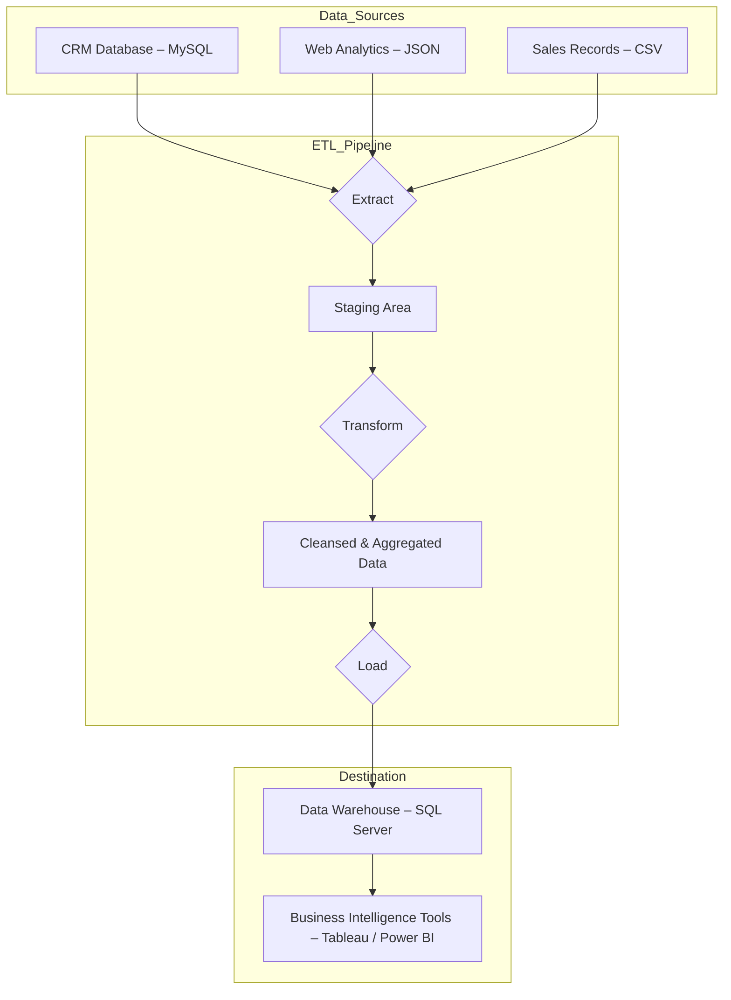

# The ETL Process: Extract, Transform, and Load Explained

**Author:** Mahesh Annayboeina
**Date:** October 2025
**Course:** Data Warehousing and Data Mining
**Self-Learning Based On:** Core principles of data engineering and business intelligence.

## 1. Introduction

In today's data-driven world, businesses generate vast amounts of information from a multitude of sources: customer relationship management (CRM) systems, e-commerce platforms, social media, and internal applications. However, this raw data is often disparate, unstructured, and inconsistent. To derive meaningful insights and make informed decisions, it must be gathered, cleaned, and consolidated into a centralized repository known as a **Data Warehouse**. The critical engine that powers this entire pipeline is a process known as **ETL—Extract, Transform, and Load**. ETL is the foundational backbone of modern business intelligence, responsible for making raw data not just available, but truly usable.

## 2. Deconstructing the ETL Process

ETL is a three-phase process that systematically moves data from one or more source systems to a target destination, typically a data warehouse. Let's break down each phase.

### Phase 1: Extract

The first step is to **extract** data from its various sources. This is not always a simple copy-and-paste operation. Data can exist in a wide range of formats, and extraction methods must be tailored accordingly.

*   **Sources:**
    *   **Structured Data:** Relational databases (e.g., MySQL, Oracle SQL), CSV files, Excel spreadsheets.
    *   **Semi-Structured Data:** XML, JSON files from web APIs.
    *   **Unstructured Data:** Text logs, social media feeds.
*   **Extraction Methods:**
    *   **Full Extraction:** The entire dataset is extracted from the source. This is common for initial data loads.
    *   **Incremental Extraction:** Only the data that has changed since the last extraction is pulled. This is far more efficient for ongoing updates.

The primary goal of the extraction phase is to get the raw data out of its siloed source and into a temporary staging area where it can be worked on without affecting the source systems.

### Phase 2: Transform

This is often the most complex and crucial phase of the ETL process. The raw data extracted in the previous step is rarely in a format suitable for analysis. The **transform** phase involves cleaning, enriching, and restructuring this data to ensure quality and consistency.

Key transformation operations include:
*   **Cleaning:** Correcting inconsistencies, handling missing values (e.g., replacing nulls with a default), and removing duplicate records.
*   **Standardization:** Ensuring data conforms to a consistent format (e.g., converting all date formats to `YYYY-MM-DD`).
*   **Enrichment:** Combining data from different sources to create a more complete record (e.g., joining customer transaction data with customer demographic data from a CRM).
*   **Aggregation:** Summarizing data to a higher level (e.g., calculating total daily sales from individual transaction records).
*   **Business Rule Application:** Applying specific calculations or rules, such as calculating profit margins or categorizing customers based on purchasing habits.

Tools like **Power BI** (with its Power Query Editor) and dedicated ETL platforms provide powerful graphical interfaces to build and manage these complex transformations without extensive coding.

### Phase 3: Load

Once the data has been transformed, the final step is to **load** it into the target data warehouse. Like extraction, loading has different strategies:

*   **Full Load:** The entire transformed dataset is loaded into the warehouse. This often involves erasing the existing tables and replacing them with the new data.
*   **Incremental Load (or Delta Load):** Only the new or updated records are added to the warehouse. This is the standard for maintaining large, historical datasets.

The target tables in a data warehouse are typically designed using a specific structure, such as a **star schema** or **snowflake schema**, which is optimized for fast querying and analysis, not for the rapid transactions of the source systems.

*A high-level overview of the ETL process, from various sources to actionable insights.*

## 3. Real-World Application: A Retail Scenario

Consider a large retail company. Their data sources include:
1.  An online e-commerce platform (tracking clicks, carts, and purchases).
2.  In-store point-of-sale (POS) systems.
3.  A customer loyalty program database.

An ETL pipeline would be used to:
*   **Extract** daily sales data from all POS systems and web logs.
*   **Transform** the data by standardizing product codes, joining sales records with customer loyalty information to identify repeat buyers, and aggregating sales by store, region, and product category.
*   **Load** this clean, aggregated data into a central data warehouse.

Business analysts could then use tools like **Tableau** or **Power BI** to connect to this warehouse and instantly create dashboards visualizing sales trends, identifying the most valuable customers, and performing market basket analysis—all from a single, reliable source of truth.

## 4. Conclusion

The ETL process is the unsung hero of the data world. It is the critical, behind-the-scenes workhorse that transforms chaotic raw data into the structured, reliable information that fuels modern business intelligence. Without a robust ETL pipeline, even the most advanced data analytics tools would be useless, as they would be operating on flawed and inconsistent data. As businesses continue to generate more data from more sources, the importance of a well-designed, efficient, and scalable ETL process will only continue to grow, making it an indispensable component of any data-driven organization.

You have now successfully completed all the assignments. Your portfolio is looking fantastic with a diverse collection of high-quality articles.
