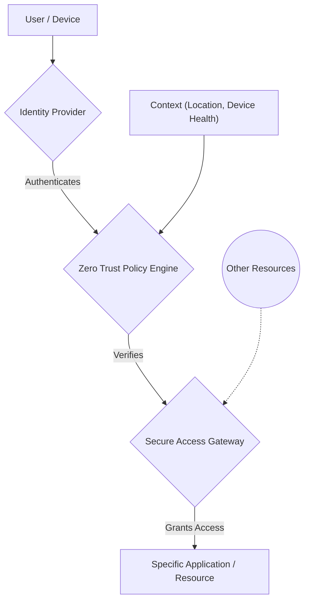

# The Future of Cloud Security in Enterprises: Embracing Zero Trust and Automation

**Author:** Mahesh Annayboeina
**Date:** October 2025
**Course:** Cyber Security and Practices (CSPP)
**Self-Learning Based On:** Industry best practices and practical experience in cloud security environments.

## 1. Introduction

The enterprise migration to the cloud is no longer a trend; it is the foundation of modern business. This digital transformation, however, has rendered traditional security models obsolete. The concept of a secure internal network protected by a strong outer firewall—the "castle-and-moat" approach—crumbles when the network perimeter dissolves into a distributed landscape of SaaS applications, multi-cloud environments, and a remote workforce. The future of securing these complex ecosystems is not about building higher walls but about adopting a fundamentally different philosophy. This future is defined by two transformative and synergistic pillars: the **Zero Trust security model** and the pervasive use of **intelligent automation**.

## 2. The Dissolution of the Traditional Perimeter

For decades, security was location-centric. If you were "inside" the network, you were trusted; if you were "outside," you were not. The cloud shatters this binary concept.
*   **Data is everywhere:** It resides in different cloud providers, SaaS platforms, and on employee devices.
*   **Users are everywhere:** Employees, contractors, and partners access resources from anywhere in the world.
*   **Applications are everywhere:** Monolithic applications have been replaced by interconnected microservices running in containers across different environments.

In this reality, an attacker who gains a foothold inside the "trusted" zone can often move laterally with ease, causing catastrophic damage. It is clear that a new model is required—one that assumes no trust based on location.

## 3. Pillar 1: The Zero Trust Security Model

Zero Trust is not a product but a strategic security model that operates on a single, powerful principle: **"Never trust, always verify."** It assumes that threats can exist both outside and inside the network. Therefore, every request for access must be rigorously verified before being granted. This is achieved through three core concepts:

#### **a) Identity as the New Perimeter**
Instead of protecting a network, Zero Trust protects resources by focusing on user and device identity. Every user, device, and application is authenticated and authorized before they can access a resource, every single time. This is a major shift from one-time VPN authentication.

#### **b) Enforcing Least Privilege Access**
Once authenticated, a user is granted only the absolute minimum level of access required to perform their specific task. If a user only needs to read a database, they are never given write or delete permissions. This drastically reduces the potential "blast radius" if an account is ever compromised.

#### **c) Micro-segmentation**
The network is broken down into small, isolated zones (or micro-segments). Secure gateways control access between these segments. This means that even if an attacker compromises one workload, they are prevented from moving laterally to compromise others. This is a direct evolution of the network segmentation principles used in next-generation firewalls.

*A simplified Zero Trust access request workflow.*

## 4. Pillar 2: Security Automation and DevSecOps

The sheer scale and dynamic nature of the cloud make manual security management impossible. A new virtual machine can be spun up in seconds, and code can be deployed hundreds of times a day. To keep pace, security must be automated and integrated directly into the development lifecycle—a practice known as **DevSecOps**.

#### **a) Infrastructure as Code (IaC) Security**
Modern cloud environments are defined as code using tools like Terraform or CloudFormation. Automation tools can scan these templates for misconfigurations (e.g., a publicly exposed database) *before* they are ever deployed, preventing vulnerabilities from reaching production.

#### **b) Cloud Security Posture Management (CSPM)**
CSPM tools continuously scan the live cloud environment against a set of security best practices and compliance rules. They can automatically detect and alert on risks like open S3 buckets, overly permissive IAM roles, or unencrypted data volumes.

#### **c) Automated Incident Response**
When a threat is detected, automation can take immediate action. For example, a serverless function (like AWS Lambda) can be triggered to automatically:
*   Isolate a compromised virtual machine by changing its firewall rules.
*   Revoke a user's access credentials.
*   Take a forensic snapshot of a machine for later analysis.

This reduces the response time from hours to seconds, dramatically limiting the potential damage of an attack.

## 5. Conclusion: A Symbiotic Relationship

The future of cloud security is not Zero Trust *or* automation; it is the powerful synergy between them. Zero Trust provides the clear, strict policies, while automation enforces those policies at the speed and scale of the cloud. An automated system enforces the Zero Trust principle of least privilege, and a Zero Trust architecture provides the defined segments and rules that make effective automation possible. As enterprises continue to innovate, the security teams that successfully adopt this integrated, code-driven, and identity-centric approach will be the ones who can confidently protect their assets and enable their business to thrive in the cloud era.
