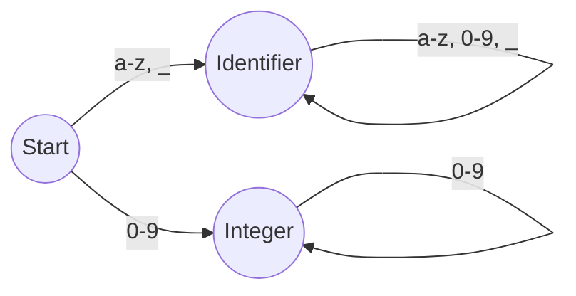

# Regular Expressions: The Unsung Heroes of Compilers and Modern Programming

**Author:** Mahesh Annayboeina
**Date:** October 2025
**Course:** Theory of Computation & Compiler Design (TC&CD)
**Self-Learning Based On:** Formal language theory and practical applications in software development.

## 1. Introduction

In the vast landscape of computer science, few tools are as ubiquitous yet as fundamentally tied to theoretical principles as Regular Expressions (regex). At its core, a regular expression is a sequence of characters that specifies a search pattern. While many developers know them as a powerful tool for string manipulation and input validation, their role is far more profound. Regular expressions form the bedrock of the very first phase of compilation—lexical analysis—and their efficiency is a direct result of their deep connection to the mathematical concept of Finite Automata. This article explores the dual life of regular expressions: as a theoretical construct essential for compiler design and as an indispensable, practical tool for developers in modern programming languages.

## 2. The Theoretical Foundation: Finite Automata

Before a compiler can understand code, it must first break it down into a sequence of meaningful units called "tokens." The part of the compiler responsible for this is the **lexical analyzer** (or scanner). The fundamental question the lexer must answer is: "How do I recognize the patterns that define a token?"

This is where formal language theory comes in. Regular expressions provide a concise and formal way to define the patterns for every token in a programming language. For example:
*   **Identifier:** A letter or underscore, followed by any number of letters, numbers, or underscores.
*   **Integer:** A sequence of one or more digits.
*   **Keyword:** The exact character sequence `if`, `else`, `while`, etc.

Each of these definitions can be perfectly described by a regular expression. The true power, however, comes from the fact that every regular expression can be converted into an equivalent **Finite Automaton (FA)**—a simple machine that can recognize whether a given string belongs to the language defined by the regex.

*A simplified Finite Automaton recognizing basic identifiers and integers.*

Tools like **Lex** and **Flex** automate this process. They take a set of regular expressions as input and generate highly optimized C code for a lexical analyzer based on the principles of finite automata. This conversion is what makes lexical analysis incredibly fast and efficient.

## 3. Regex in Compilers: The Lexical Analysis Phase

The primary role of regular expressions in a compiler is to define the "lexical grammar" of a language. The lexer uses these definitions to scan the raw source code and produce a stream of tokens.

Consider this simple line of code: `if (x > 10)`

The lexical analyzer, armed with regular expressions, would break it down as follows:

| Lexeme (String) | Regular Expression Pattern | Token |
| :--- | :--- | :--- |
| `if` | `if` | KEYWORD_IF |
| `(` | `\(` | L_PAREN |
| `x` | `[a-zA-Z_][a-zA-Z0-9_]*` | IDENTIFIER |
| `>` | `>` | OPERATOR_GT |
| `10` | `[0-9]+` | INTEGER_LITERAL |
| `)` | `\)` | R_PAREN |

Without regular expressions to formally define these patterns, building a reliable and efficient lexer would be an immensely complex and error-prone task. They provide the precise, unambiguous rules needed to transform a simple string of text into the structured input required by the next phase of compilation, the parser.

## 4. Real-World Applications in Modern Programming

Beyond compilers, regular expressions are a daily tool for software developers across all domains. The same pattern-matching power is exposed through libraries in virtually every modern language.

#### **a) Input Validation**
This is one of the most common use cases. Regex ensures that user input conforms to a specific format before it is processed, preventing errors and security vulnerabilities.
*   **Email Validation:** `^[a-zA-Z0-9._%+-]+@[a-zA-Z0-9.-]+\.[a-zA-Z]{2,}$`
*   **Password Strength:** `^(?=.*[a-z])(?=.*[A-Z])(?=.*\d)[a-zA-Z\d]{8,}$` (ensuring at least one lowercase, one uppercase, one digit, and 8+ characters).

#### **b) Log Parsing and Data Extraction**
System administrators and developers work with massive log files. Regular expressions are essential for parsing these logs to find specific error messages, IP addresses, or timestamps.
*   A regex like `^(\d{1,3}\.\d{1,3}\.\d{1,3}\.\d{1,3})` can instantly extract all IP addresses from a file.

#### **c) Search and Replace Operations**
Powerful search-and-replace functionality in text editors like VS Code and command-line tools like `grep` is driven by regular expressions. A developer can, for instance, refactor a variable name across hundreds of files with a single, precise regex command.

#### **d) Web Scraping**
When extracting data from websites, regex can be used to pull specific information, like phone numbers, links, or product prices, from raw HTML content.

## 5. Conclusion

Regular expressions represent a perfect marriage of theoretical computer science and practical software engineering. Born from the abstract world of automata theory, they provide the formal foundation that makes modern compilers possible. At the same time, they have become one of the most powerful and accessible tools for developers, enabling complex pattern matching in everything from simple scripts to large-scale enterprise applications. Understanding both their theoretical underpinnings and their practical applications is a hallmark of a well-rounded computer scientist. They are, without a doubt, one of the most impactful and enduring concepts in the field.
