# A Practical Guide to Software Development Life Cycle (SDLC) Models

**Author:** Mahesh Annayboeina
**Date:** October 2025
**Course:** Software Engineering & Project Management
**Self-Learning Based On:** Foundational software engineering principles and project management best practices.

## 1. Introduction

In the world of software development, creating a successful product is more than just writing code. It requires a structured, methodical approach to navigate the journey from an initial idea to a fully functional and maintained application. This structured process is known as the **Software Development Life Cycle (SDLC)**. The SDLC provides a framework for planning, developing, testing, and deploying high-quality software, ensuring that projects are completed on time, within budget, and to the satisfaction of stakeholders. Choosing the right SDLC model is one of the most critical decisions in project management, as it dictates the workflow, communication patterns, and adaptability of the entire development team. This article explores four fundamental SDLC models, outlining their concepts, applications, and their vital importance in the IT industry.

## 2. Core Phases of the SDLC

Regardless of the model chosen, almost every SDLC process includes the following core phases:
*   **Planning & Requirement Analysis:** Defining project goals and gathering requirements from stakeholders.
*   **Design:** Architecting the system, including hardware, software, and data models.
*   **Development (Implementation):** Writing the actual code based on the design specifications.
*   **Testing:** Verifying that the software is bug-free and meets all requirements.
*   **Deployment:** Releasing the software to users.
*   **Maintenance:** Providing ongoing support, updates, and enhancements.

## 3. Exploring Key SDLC Models

The main difference between SDLC models is the way they handle these phases. Let's explore some of the most influential models.

### a) The Waterfall Model

The Waterfall Model is the most traditional and straightforward SDLC approach. It is a linear-sequential model where each phase must be fully completed before the next begins. Progress flows steadily downwards, like a waterfall, through the different stages.

**Real-life Application:** This model is best suited for projects where requirements are well-understood, fixed, and unlikely to change. For example, building a simple inventory management system for a small business or a government project with legally mandated, unchangeable specifications.

*The rigid, top-down flow of the Waterfall Model.*

*   **Importance:** It emphasizes discipline and thorough documentation, making it easy to manage. However, its rigidity is its biggest weakness; a change in requirements late in the process can be disastrously expensive.

### b) The V-Model (Verification & Validation Model)

The V-Model is an extension of the Waterfall Model that places a strong emphasis on testing. For every phase in the development life cycle, there is a directly associated testing phase. For example, Unit Tests are designed during the implementation phase, and Acceptance Tests are planned during the requirement analysis phase.

**Real-life Application:** The V-Model is used in critical systems where failure is not an option. This includes medical software (e.g., patient monitoring systems), avionics software for aircraft, and automotive control systems, where rigorous testing and validation are paramount.

*The V-Model illustrates the relationship between each development stage and its corresponding testing phase.*

*   **Importance:** It promotes early test planning and helps in detecting bugs at an early stage, which reduces project risk and ensures a high-quality product.

### c) The Agile Model

Agile is not a single model but a philosophy that prioritizes flexibility, collaboration, and customer feedback. Development is done in short, iterative cycles called "sprints" (typically 2-4 weeks long). At the end of each sprint, the team delivers a small, working piece of the product, which can be reviewed by stakeholders.

**Real-life Application:** Agile is the dominant model in the modern IT industry, especially for web and mobile applications, startups, and any project where requirements are expected to evolve. Companies like Spotify and Google use Agile methodologies to continuously innovate and respond to market changes.

```mermaid
graph LR
    A[Product Backlog] --> B[Sprint Planning]
    B --> C{Sprint – 2 to 4 Weeks}
    C --> D[Working Increment of Software]
    D --> E[Sprint Review]
    E --> A

```

*The iterative cycle of an Agile/Scrum process.*

*   **Importance:** Agile allows teams to adapt to change quickly, delivers value to customers faster, and fosters a culture of collaboration and continuous improvement.

### d) The Spiral Model

The Spiral Model is a risk-driven model that combines elements of both the Waterfall and iterative approaches. The project passes through four phases in a spiral (or iterative) fashion: Planning, Risk Analysis, Engineering (Development & Testing), and Evaluation. It is ideal for large, complex, and high-risk projects.

**Real-life Application:** This model is often used for developing new technologies or for large-scale systems where the requirements are not fully understood at the start. NASA reportedly used an early form of the Spiral Model for the Space Shuttle software, as risk management was the primary concern.

*   **Importance:** Its main advantage is its comprehensive risk-handling. By analyzing risks at every stage, it helps prevent project failures. However, it can be complex and costly, making it unsuitable for smaller, low-risk projects.

## 4. Conclusion

There is no "one-size-fits-all" solution in software development. The choice of an SDLC model is a critical strategic decision that directly impacts a project's success. A project with clear, unchanging requirements might benefit from the structure of the Waterfall model, while a fast-paced market-driven application would fail without the flexibility of Agile. Understanding the strengths and weaknesses of each model allows project managers and software engineers to select the right framework for the job, ensuring a smoother development process and a final product that truly meets the user's needs. In the dynamic IT industry, this ability to choose and implement the correct life cycle model is an indispensable skill.
